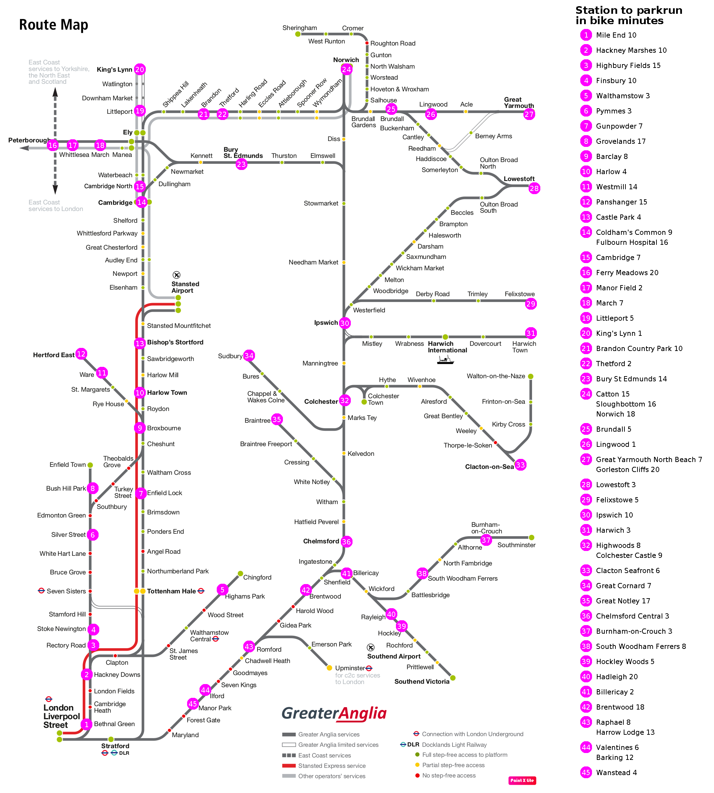

# Parkrun map generator

A utility which generates a train map for area parkruns.  It takes a background train
map [like this](resources/source.png) and a tab-delimited data file of parkrun location
data [like this](resources/parkruns.csv) and produces a map like this:

You'll probably want to do multiple runs, adjusting the data file to correctly place the
markers.  To assist with this process, set the flag to generate the output file with
marked grid lines.

The executable class is org.computronium.parkrunmap.ParkrunMap.  The program accepts these options:

    -d FILE, --data FILE
        Read parkrun data from the given file.

    -b FILE, --background FILE
        Use the given file as the background map.

    -o FILE, --output FILE
        Generate the annotated map to the given file.

    -m MAX, --max-minutes MAX
        Only show parkruns that are within the given number of minutes from their station.

    -g, --grid-lines
        Generate the output map with labelled grid lines, to assist in figuring out the proper
        coordinates to put in the data file on the next run.

    -x INDEX_X, --index-x INDEX_X
        Put the map index at the given x coordinate.

    -y INDEX_Y, --index-y INDEX_Y
        Put the map index at the given y coordinate.
