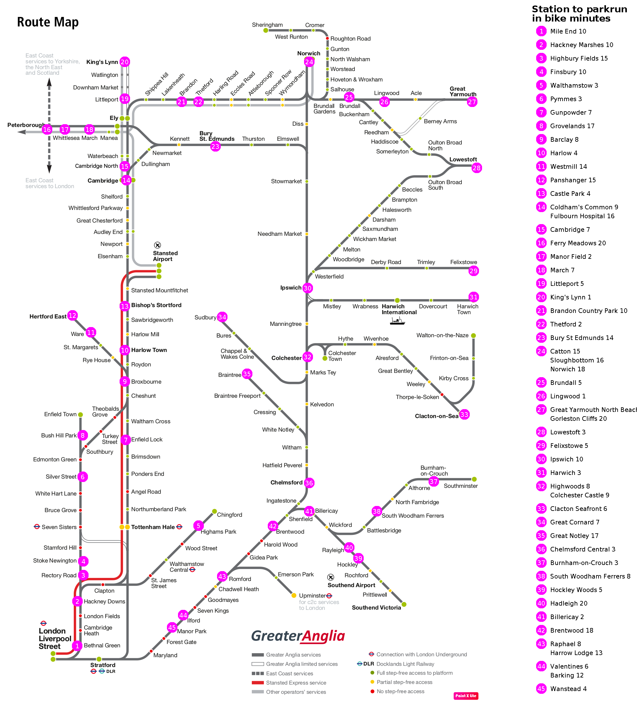

# Parkrun map generator

A utility which generates a train map for area parkruns.  It takes a background train
map [like this](resources/great-northern-source.png) and a tab-delimited data file of parkrun location
data [like this](resources/great-northern-parkruns.tsv) and produces a map like this:

You'll probably want to do multiple runs, adjusting the data file to correctly place the
markers.  To assist with this process, set the flag to generate the output file with
marked grid lines.

The executable class is org.computronium.parkrunmap.ParkrunMap.  The program accepts these options:

    -d FILE, --data FILE
        Read parkrun data from the given file.

    -b FILE, --background FILE
        Use the given file as the background map.

    -o FILE, --output FILE
        Generate the annotated map to the given file.

    -m MAX, --max-minutes MAX
        Only show parkruns that are within the given number of minutes from their station.

    -g, --grid-lines
        Generate the output map with labelled grid lines, to assist in figuring out the proper
        coordinates to put in the data file on the next run.

    -x INDEX_X, --index-x INDEX_X
        Put the map index at the given x coordinate.

    -y INDEX_Y, --index-y INDEX_Y
        Put the map index at the given y coordinate.

## Example

This is how to generate the example shown above with the input files mentioned above:

    java org.computronium.parkrunmap.ParkrunMap -d resources/parkruns.tsv -b resources/source.png -o output/GreaterAngliaParkruns.png -m 20 -x 1730 -y 40

## Data file format

The data file should be a tab-separated tsv file.  The first row is considered a header line and is ignored.  The columns are:

Column 1: **Parkrun name** -- The name of the parkrun.

Column 2: **Location** -- The location, for reference (not used by the generator).

Column 3: **Nearest station** -- The name of station closest to the parkrun.

Column 4: **Index X** -- The x coordinate of where to create the index.

Column 5: **Index Y** -- The y coordinate of where to create the index.

Column 6: **Sort** -- A number used to sort the stations in the index.  Numbers in the column are only relative and
will be normalized.  For example, a map with only 3 parkruns numbered 1, 1.5, and 2 will be generated as markers 1, 2, 3.
This allows you to insert and remove items, or to change the maximum bike time, without having to generate all new
marker numbers.

Column 7: **Maximum bike time** -- Tells the generator to only show parkruns within this many minutes by bike from
their nearest station.

## Sources

Original PDF: https://www.greatnorthernrail.com/destinations-and-offers/where-we-travel-to/our-routes